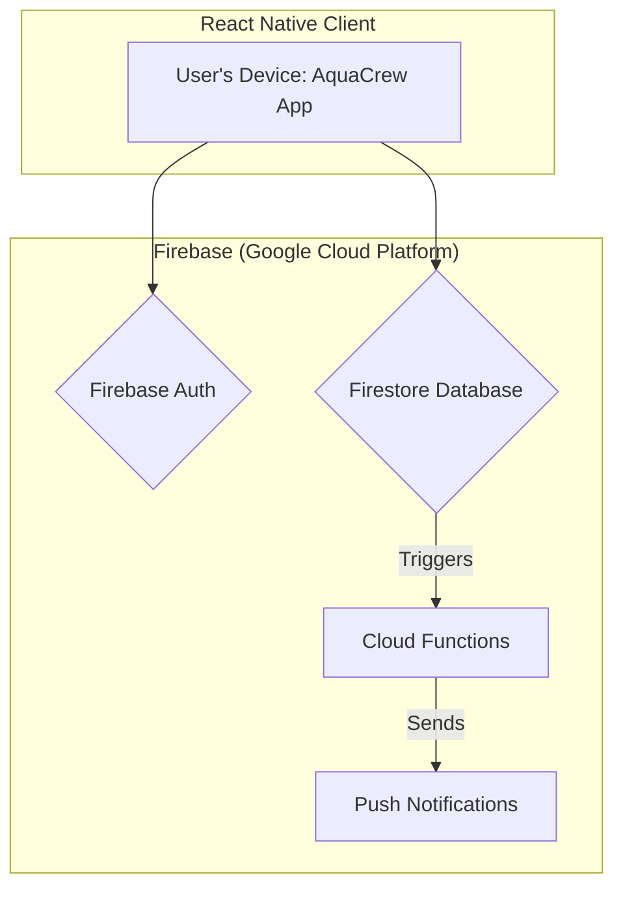

# AquaCrew Project

AquaCrew is a mobile-first social wellness app designed to transform hydration from a chore into a fun, rewarding, and connected experience. By leveraging positive social accountability and gamification, AquaCrew aims to build a supportive community where users feel celebrated for their progress, fostering intrinsic motivation and long-term habit formation.

The core problem we are solving is that millions of people struggle to drink enough water because they forget, find it boring, or lack motivation. Existing trackers are often isolating and feel like work. AquaCrew's solution is to make hydration a collective goal, built on a foundation of team encouragement and shared achievements.

---

### Our Guiding Principles

Every feature and technical decision for AquaCrew will be measured against these three core product pillars:

* **Social First:** The core value comes from connection. Features should encourage positive interaction, friendly competition, and shared success.
* **Radically Simple:** The core tracking experience must be effortless and joyful. We will reduce friction at every step and avoid feature bloat.
* **Fun & Rewarding:** The app should feel like a game, not a medical device. We will use positive reinforcement and delightful UI to make users feel good about their progress.

---

### Stack-at-a-Glance

| Category           | Technology               | Reason                                                                                                                                              |
| :----------------- | :----------------------- | :-------------------------------------------------------------------------------------------------------------------------------------------------- |
| **Mobile Framework** | React Native, TypeScript | Leverages our team's existing React expertise for rapid, cross-platform (iOS & Android) development with end-to-end type safety.                    |
| **Backend Platform** | Firebase (Google Cloud)  | A comprehensive Backend-as-a-Service (BaaS) providing our database, authentication, serverless functions, and analytics in a tightly integrated, scalable suite. |
| **Database**| Firestore                | A real-time, NoSQL document database that allows for live data synchronization between clients, perfect for features like the team dashboard.          |
| **Authentication**| Firebase Authentication  | A secure, managed identity service that handles sign-up, sign-in (including social providers), and user session management.                            |
| **Serverless Logic**| Firebase Cloud Functions | Event-driven, serverless functions that react to database and authentication events, used for backend logic like sending nudges and awarding badges. |
| **State Management**| Zustand                  | A lightweight, minimalist state management library for React that simplifies managing global app state without excessive boilerplate.               |
| **Styling**| NativeWind               | A utility-first styling solution that brings the power and developer experience of Tailwind CSS to React Native.                                        |

---
### Architecture Diagram

```markdown

---

### Core Technologies & Principles

#### Mobile Framework: React Native + TypeScript
* **Our Philosophy**: We are leveraging our team's deep expertise in React to build a native mobile application for both iOS and Android from a single codebase. **TypeScript** is non-negotiable, ensuring type safety from the database to the UI components, which drastically reduces runtime errors.
>   **Developer Takeaway**: Build small, reusable components. Fully type all props, state, and API payloads.

#### Backend: Firebase BaaS
* **Our Philosophy**: We are "Serverless First." Instead of building and managing our own backend infrastructure, we are using the comprehensive Firebase suite. This allows us to focus entirely on building a great user experience. Our backend is not a traditional REST API; instead, the client interacts directly and securely with Firebase services.
>   **Developer Takeaway**: Familiarize yourself with the Firebase SDKs. Most backend "work" is done by writing clever client-side queries and robust security rules.

#### Database & Security: Firestore + Security Rules
* **Our Philosophy**: Firestore provides real-time data synchronization out of the box, which is essential for our social features. Our security is not handled in API middleware, but rather in **Firestore Security Rules**. These are powerful, declarative rules hosted on Firebase that define who can read, write, and query data. For example, a user can only update their *own* profile and can only read the profiles of their teammates.
>   **Developer Takeaway**: Always think about security rules when designing a feature. Before writing a query, ask "What rule will I need to write to make this query possible and secure?"

#### Serverless Logic: Firebase Cloud Functions (with Triggers)
* **Our Philosophy**: Our serverless functions are not for creating simple CRUD APIs. They are reserved for privileged actions and, most importantly, for reacting to events within our Firebase project. We use an event-driven architecture.
>   **Developer Takeaway**: Don't write a Cloud Function to simply get or set data. Use the client SDK for that. Write a function when you need to do something the client *can't* or *shouldn't* do, like sending a push notification after data is written.

#### State Management: Zustand
* **Our Philosophy**: For managing global state that is shared across many components (like the current user's profile or team information), we use Zustand. It's simple, unopinionated, and uses a hooks-based API that feels natural in a React environment. It helps us avoid "prop drilling" and keeps our component logic clean.
>   **Developer Takeaway**: Use component state (`useState`) for local UI state. Use a Zustand store for global data that needs to be accessed or updated from multiple, distant parts of the app.

---

### Getting Started: Running Locally

This project uses native libraries (like Firebase) and therefore requires a custom **Development Build** to run on a physical device or simulator. You cannot use the standard Expo Go app.

**1. Installation:**

*   Clone the repository: `git clone [repo-url]`
*   Navigate into the project directory: `cd aquacrew`
*   Install dependencies: `npm install`

**2. Create the Development Build (One-Time Setup):**

This command uses Expo Application Services (EAS) to build a custom version of the app that includes all our native dependencies. This can take 10-15 minutes.

npx eas build --profile development --platform android
Use code with caution.
Markdown
(Use --platform ios for an iOS simulator build).
After the build is complete, scan the resulting QR code with your device's camera to download and install the AquaCrew.apk file.

**3. Run the Development Server:**
This is the command you will run for daily development. It starts the Metro server that bundles your JavaScript code and serves it to your app.

npx expo start --tunnel

**4. Connect the App:**
Open the AquaCrew app you installed on your phone.
In the developer menu that appears, tap "Scan QR code".
Scan the QR code shown in your terminal from the npx expo start command.
The app will now connect to the server and load the project. Any changes you make to the code will appear instantly on your device.


---


## Development Workflow

This project follows a **Feature Branching** workflow to ensure the `main` branch remains stable and deployable at all times.

1.  **Create a New Branch**: For any new feature or bug fix, create a new, descriptive branch from `main` (e.g., `feat/user-onboarding` or `fix/streak-counter-bug`).
2.  **Develop in Isolation**: All work for the feature should be done on this branch.
3.  **Open a Pull Request**: Once the feature is complete and tested, open a Pull Request to merge the feature branch back into `main`. This allows for code review and discussion.

---

### Project Status & Roadmap

#### Current Status
* **Foundation Stable:** The project's foundation is stable and correctly configured.
* **Authentication Complete:** Includes sign-up, sign-in, and session persistence.
* **Onboarding Complete:** A one-time flow for new users to set up their profile.
* **Home Screen v1 Complete:** The home screen UI is built and connected to Firestore for real-time progress tracking.
* **Streak Logic Complete:** ✅ Cloud Function deployed for real-time streak calculation with milestone celebrations.
* **Code Architecture:** ✅ Refactored to clean hook-based architecture with separation of concerns.
* **Usage Monitoring Complete:** ✅ Comprehensive Firebase usage monitoring system with cost protection deployed.

## Recent Updates
✅ **Firebase Usage Monitoring System Complete** (Latest)
✅ Streak Calculation System Complete
✅ Expo Router navigation issue resolved  
✅ Authentication and onboarding flow working
✅ Real-time hydration tracking implemented
✅ Clean hook-based architecture established

#### Usage Monitoring & Cost Control
* **Real-time Usage Tracking**: Monitors all Firestore operations and Cloud Function executions
* **Daily Limits**: Enforces conservative limits (75% of free tier) to prevent unexpected costs
* **Smart Alerts**: Three-tier alert system (safe/warning/danger) guides users on usage
* **Automatic Prevention**: Blocks operations that would exceed daily quotas with user-friendly messages
* **Developer Dashboard**: Visual usage monitor showing real-time statistics (development only)
* **Persistent Tracking**: Usage data persists across app restarts using AsyncStorage
* **Daily Reset**: Counters automatically reset at midnight for fresh daily quotas

**Technical Implementation**:
- `useUsageMonitor` hook: Core tracking logic with AsyncStorage persistence
- `UsageDashboard` component: Visual monitoring interface for developers
- Integrated with all Firestore operations through existing hooks
- Zero performance impact - lightweight counters with minimal overhead

#### Critical Next Steps (Blaze Plan Requirements)
1.  **Usage Monitoring & Cost Control:** ✅ **COMPLETED**
    * ✅ Deploy usage monitoring dashboard component
    * ✅ Implement daily usage limits and automated alerts
    * ✅ Configure automatic operation blocking when limits exceeded
    * 🔄 Set up Firebase Console budget alerts ($1 threshold)
    * 🔄 Implement emergency killswitch functions
2.  **Testing & Validation:**
    * Complete streak function testing with existing users
    * Verify milestone celebrations work correctly
    * Validate real-time updates and data consistency
    * ✅ Test usage monitoring system functionality

#### Immediate Next Steps (MVP v1.0)
1.  **Team Goal / Social Tracking:**
    * Design the Firestore data model for teams.
    * Build the UI for creating and joining a team.
    * Implement the "Team Goal" progress view on the home screen.
2.  **UI/UX Polish:**
    * Add a "show/hide" password toggle icon to the auth screens.
    * Improve loading states and error handling.

#### Detailed Feature Roadmap

##### Phase 1: Teams (Social Accountability)
1. **Create/Join Team Flow:**
   * Build UI for team creation with invite code generation
   * Implement Firestore data model for teams and memberships
   * Create join team flow with invite code validation
   * Add team selection during onboarding process

2. **Team Dashboard:**
   * Display list of teammates with real-time daily progress
   * Show team-wide hydration statistics and goals
   * Implement team leaderboards and friendly competition
   * Real-time sync of all team member progress

3. **The "Nudge" Feature:**
   * Add nudge button to teammate profiles
   * Implement push notification logic for sending reminders
   * Design notification templates and messaging
   * Rate limiting to prevent spam (max nudges per day)

##### Phase 2: Achievements & Sharing (Gamification & Virality)
1. **Badge System:**
   * Create Cloud Function logic for milestone badge awards
   * Design badge categories (streaks, volumes, consistency, social)
   * Implement badge unlock animations and celebrations
   * Store badge achievements in user profiles

2. **Achievements UI:**
   * Build dedicated Achievements screen with badge grid
   * Show locked/unlocked states with progress indicators
   * Add badge detail views with earning criteria
   * Implement achievement sharing to team feeds

3. **Social Sharing Flow:**
   * Dynamic image generation for badge achievements
   * Social media sharing integration (Instagram, Twitter, Facebook)
   * Customizable sharing templates and messaging
   * Track viral coefficient and sharing analytics

##### Phase 3: Monetization (Post-MVP)
1. **Premium Features:**
   * Custom water amount tracking (beyond 250ml increments)
   * Advanced analytics and insights dashboard
   * Premium badge designs and exclusive achievements
   * Ad-free experience for paid users

2. **In-App Purchases:**
   * "Streak Shields" - protect streaks during missed days
   * Cosmetic themes and app customization options
   * Premium team features (larger teams, advanced stats)
   * Early access to new features and beta testing

3. **Subscription Tiers:**
   * Free tier: Basic tracking, 4-person teams, standard badges
   * Premium tier: Advanced features, unlimited team size, premium content
   * Team tier: Organization-wide deployments and admin controls

##### Phase 4: Advanced Features (Long-term)
1. **Smart Notifications:**
   * AI-powered personalized reminder timing
   * Weather-based hydration goal adjustments
   * Integration with health apps and wearables
   * Predictive analytics for optimal hydration patterns

2. **Community Features:**
   * Public leaderboards and competitions
   * Hydration challenges and events
   * User-generated content and tips sharing
   * Expert nutritionist content and advice

3. **Platform Expansion:**
   * Web dashboard for detailed analytics
   * Apple Watch and fitness tracker integration
   * Corporate wellness program features
   * API for third-party health app integrations

#### Technical Roadmap

##### Immediate (Next 2 weeks)
* ✅ Streak calculation Cloud Functions
* ✅ Usage monitoring and cost control systems
* 🔄 Emergency killswitch implementation
* 📋 Comprehensive testing of streak functionality

##### Short-term (1-2 months)
* Firestore security rules for team features
* Push notification infrastructure setup
* Image generation service for social sharing
* Performance monitoring and optimization

##### Medium-term (3-6 months)
* Cloud Functions refactoring into modular services
* Automated testing suite implementation
* CI/CD pipeline setup with staging environment
* Database optimization and indexing strategy

##### Long-term (6+ months)
* Microservices architecture for scale
* Advanced caching and CDN implementation
* Multi-region deployment for global performance
* Real-time analytics and business intelligence dashboard