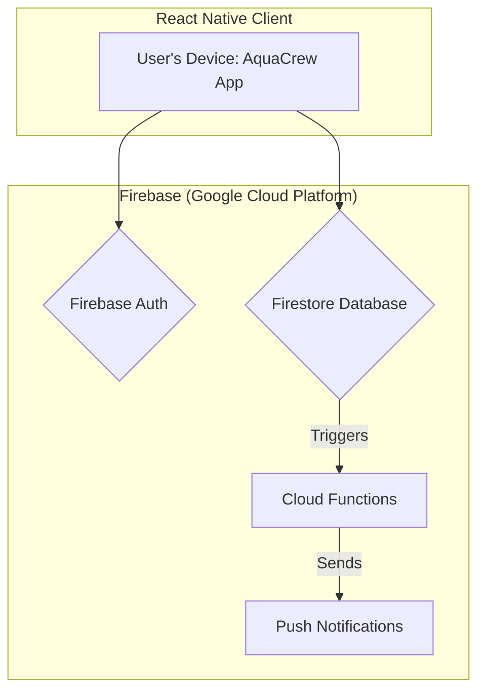

# AquaCrew Project

AquaCrew is a mobile-first social wellness app designed to transform hydration from a chore into a fun, rewarding, and connected experience. By leveraging positive social accountability and gamification, AquaCrew aims to build a supportive community where users feel celebrated for their progress, fostering intrinsic motivation and long-term habit formation.

The core problem we are solving is that millions of people struggle to drink enough water because they forget, find it boring, or lack motivation. Existing trackers are often isolating and feel like work. AquaCrew's solution is to make hydration a collective goal, built on a foundation of team encouragement and shared achievements.

---

### Our Guiding Principles

Every feature and technical decision for AquaCrew will be measured against these three core product pillars:

* **Social First:** The core value comes from connection. Features should encourage positive interaction, friendly competition, and shared success.
* **Radically Simple:** The core tracking experience must be effortless and joyful. We will reduce friction at every step and avoid feature bloat.
* **Fun & Rewarding:** The app should feel like a game, not a medical device. We will use positive reinforcement and delightful UI to make users feel good about their progress.

---

### Stack-at-a-Glance

| Category           | Technology               | Reason                                                                                                                                              |
| :----------------- | :----------------------- | :-------------------------------------------------------------------------------------------------------------------------------------------------- |
| **Mobile Framework** | React Native, TypeScript | Leverages our team's existing React expertise for rapid, cross-platform (iOS & Android) development with end-to-end type safety.                    |
| **Backend Platform** | Firebase (Google Cloud)  | A comprehensive Backend-as-a-Service (BaaS) providing our database, authentication, serverless functions, and analytics in a tightly integrated, scalable suite. |
| **Database**| Firestore                | A real-time, NoSQL document database that allows for live data synchronization between clients, perfect for features like the team dashboard.          |
| **Authentication**| Firebase Authentication  | A secure, managed identity service that handles sign-up, sign-in (including social providers), and user session management.                            |
| **Serverless Logic**| Firebase Cloud Functions | Event-driven, serverless functions that react to database and authentication events, used for backend logic like sending nudges and awarding badges. |
| **State Management**| Zustand                  | A lightweight, minimalist state management library for React that simplifies managing global app state without excessive boilerplate.               |
| **Styling**| NativeWind               | A utility-first styling solution that brings the power and developer experience of Tailwind CSS to React Native.                                        |

---
### Architecture Diagram

```markdown

---

### Core Technologies & Principles

#### Mobile Framework: React Native + TypeScript
* **Our Philosophy**: We are leveraging our team's deep expertise in React to build a native mobile application for both iOS and Android from a single codebase. **TypeScript** is non-negotiable, ensuring type safety from the database to the UI components, which drastically reduces runtime errors.
>   **Developer Takeaway**: Build small, reusable components. Fully type all props, state, and API payloads.

#### Backend: Firebase BaaS
* **Our Philosophy**: We are "Serverless First." Instead of building and managing our own backend infrastructure, we are using the comprehensive Firebase suite. This allows us to focus entirely on building a great user experience. Our backend is not a traditional REST API; instead, the client interacts directly and securely with Firebase services.
>   **Developer Takeaway**: Familiarize yourself with the Firebase SDKs. Most backend "work" is done by writing clever client-side queries and robust security rules.

#### Database & Security: Firestore + Security Rules
* **Our Philosophy**: Firestore provides real-time data synchronization out of the box, which is essential for our social features. Our security is not handled in API middleware, but rather in **Firestore Security Rules**. These are powerful, declarative rules hosted on Firebase that define who can read, write, and query data. For example, a user can only update their *own* profile and can only read the profiles of their teammates.
>   **Developer Takeaway**: Always think about security rules when designing a feature. Before writing a query, ask "What rule will I need to write to make this query possible and secure?"

#### Serverless Logic: Firebase Cloud Functions (with Triggers)
* **Our Philosophy**: Our serverless functions are not for creating simple CRUD APIs. They are reserved for privileged actions and, most importantly, for reacting to events within our Firebase project. We use an event-driven architecture.
>   **Developer Takeaway**: Don't write a Cloud Function to simply get or set data. Use the client SDK for that. Write a function when you need to do something the client *can't* or *shouldn't* do, like sending a push notification after data is written.

#### State Management: Zustand
* **Our Philosophy**: For managing global state that is shared across many components (like the current user's profile or team information), we use Zustand. It's simple, unopinionated, and uses a hooks-based API that feels natural in a React environment. It helps us avoid "prop drilling" and keeps our component logic clean.
>   **Developer Takeaway**: Use component state (`useState`) for local UI state. Use a Zustand store for global data that needs to be accessed or updated from multiple, distant parts of the app.

---

### Getting Started: Running Locally

To run this project on your local machine, you must have a complete React Native development environment set up.

1.  **Prerequisites:**
    * Node.js (v18 or later) & npm
    * Watchman (for macOS)
    * A complete [React Native CLI development environment](https://reactnative.dev/docs/environment-setup), including Xcode (for iOS) and Android Studio (for Android).

2.  **Installation:**
    * Clone the repository: `git clone [repo-url]`
    * Navigate into the project directory: `cd AquaCrew`
    * Install dependencies: `npm install`

3.  **Running on a Simulator/Emulator:**
    * **For iOS:** `npx react-native run-ios`
    * **For Android:** `npx react-native run-android`

---

### Development Workflow

This project follows a **Feature Branching** workflow to ensure the `main` branch remains stable and deployable at all times.

1.  **Create a New Branch**: For any new feature or bug fix, create a new, descriptive branch from `main` (e.g., `feat/user-onboarding` or `fix/streak-counter-bug`).
2.  **Develop in Isolation**: All work for the feature should be done on this branch.
3.  **Open a Pull Request**: Once the feature is complete and tested, open a Pull Request to merge the feature branch back into `main`. This allows for code review and discussion.
4.  **Automated Deployments**: Our GitHub Actions workflow will automatically deploy backend changes (Cloud Functions, Security Rules) upon merging to `main`.

---

## Project Status & Roadmap

### Current Status
* Project initialized with React Native and TypeScript.
* Core dependencies for Firebase, navigation, and styling have been installed.
* Initial project documentation (`README.md`) is complete.

### Immediate Next Steps (MVP v1.0)
Our immediate goal is to build the core MVP feature set as defined in the Product Requirements Document.

1.  **Firebase Integration**: Configure the native iOS and Android projects to connect to our Firebase backend.
2.  **Core User Loop**:
    * Implement user authentication (Sign up / Login).
    * Build the onboarding flow (set hydration goal).
    * Develop the Home Screen with the core tracking mechanism and streak counter.
3.  **Social Features**:
    * Implement Team creation and joining logic.
    * Build the Team Dashboard.
    * Develop the "Nudge" feature with push notifications.
4.  **Gamification & Virality**:
    * Create the Achievements system and initial badge library.
    * Build the dynamic image sharing flow for achievements.